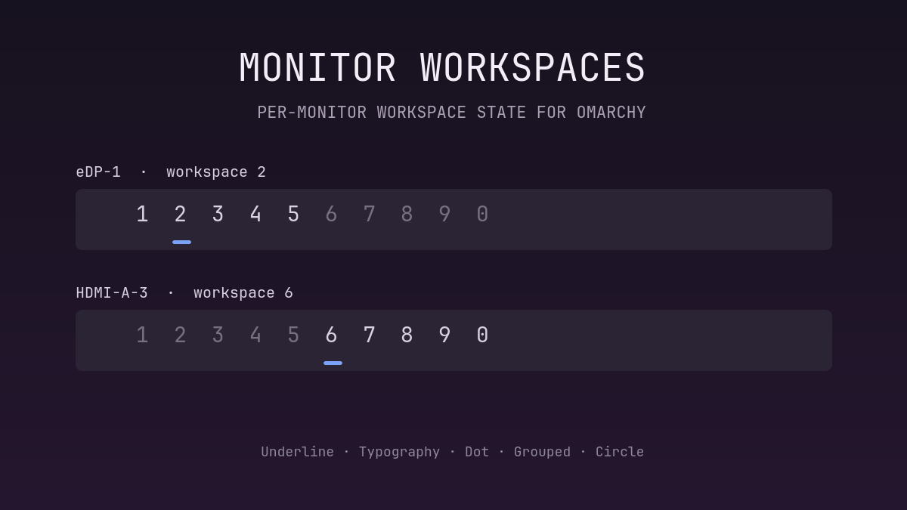

# Monitor Workspaces for Omarchy

A monitor-aware replacement for Omarchy's workspace bar widget. Each bar
marks the workspace displayed on its own monitor instead of mirroring the
globally focused workspace across every display.



## Features

- Tracks each monitor's active workspace independently.
- Distinguishes workspaces assigned to the current monitor from workspaces on
  another monitor.
- Supports top, bottom, left, and right bar positions.
- Adapts to the active Omarchy theme through the shell's shared colors.
- Includes five switchable indicator styles: Underline, Typography, Dot,
  Grouped, and Circle.
- Discovers active and persistent numbered workspaces dynamically.

## Install

```bash
omarchy plugin add https://github.com/risent/omarchy-monitor-workspaces.git --enable
```

The plugin declares itself as a replacement for `omarchy.workspaces`. When
prompted, place it in the left section of the bar.

## Requirements and dependencies

- Omarchy Quattro with the built-in Quickshell bar plugin system.
- The bundled Quickshell version must expose `QsWindow` and
  `Hyprland.monitorFor()`.
- Hyprland numbered workspaces; persistent workspace rules are recommended for
  retaining monitor ownership while a workspace is empty.

The plugin has no additional package, service, network, credential, installer,
or elevated-privilege dependency. It only uses APIs and theme components
provided by Omarchy and Quickshell.

## Configure

Open the Omarchy bar settings and edit **Monitor Workspaces**, or configure the
widget inline in `~/.config/omarchy/shell.json`:

```json
{
  "id": "io.github.risent.monitor-workspaces",
  "indicatorStyle": "Underline",
  "baseWorkspaceCount": 5,
  "maxWorkspaceId": 10
}
```

### Indicator styles

| Value | Appearance |
| --- | --- |
| `Underline` | Accent line on the workspace displayed on this monitor. |
| `Typography` | Accent-colored, slightly larger active workspace number. |
| `Dot` | Small accent dot on the displayed workspace. |
| `Grouped` | Underline plus separators where adjacent workspace monitor assignments change. |
| `Circle` | Filled active workspace and outlined workspaces assigned to this monitor. |

In every style, workspaces assigned to this monitor remain at full opacity;
workspaces assigned elsewhere are dimmed.

`baseWorkspaceCount` controls how many workspace numbers are always visible
starting at 1. Active or persistent workspaces above that range appear
automatically up to `maxWorkspaceId`.

For empty workspaces to retain a monitor assignment, configure them as
persistent Hyprland workspaces. For example:

```lua
for workspace = 1, 5 do
  hl.workspace_rule({ workspace = tostring(workspace), monitor = "eDP-1", persistent = true })
end

for workspace = 6, 10 do
  hl.workspace_rule({ workspace = tostring(workspace), monitor = "HDMI-A-1", persistent = true })
end
```

Replace the output names and ranges with those used by your system.

## Update

```bash
omarchy plugin update io.github.risent.monitor-workspaces
```

## Remove

```bash
omarchy plugin remove io.github.risent.monitor-workspaces
omarchy plugin enable omarchy.workspaces --section left
```

## Development

Validate the plugin and lint its QML:

```bash
./tests/check.sh
```

## License

MIT
